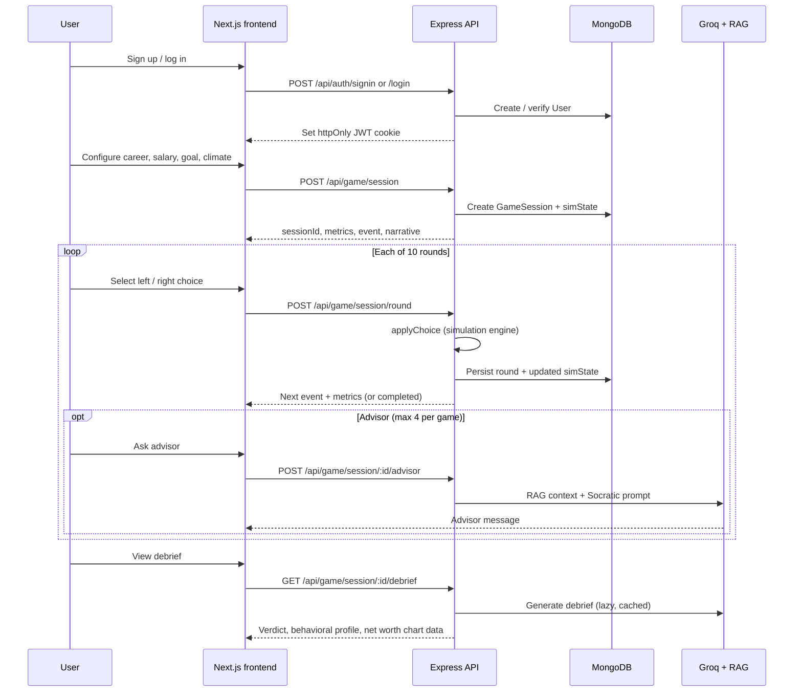

# FinSim — Live 10 Years in 15 Minutes

> A personal finance life simulator that puts players through 10 years of real financial decisions — rent, credit cards, layoffs, investments — and shows exactly where each choice leads.

FinSim is a **pnpm monorepo** with a Next.js frontend and an Express API. The simulation engine runs entirely on the server; the client renders API responses and sends player choices. Sessions, auth, AI advisor, and post-game debrief all persist through the backend.

| Package  | Path        | Name          | Role                          |
| -------- | ----------- | ------------- | ----------------------------- |
| Frontend | `frontend/` | `@finsim/web` | Next.js 16 App Router UI      |
| Backend  | `backend/`  | `@finsim/api` | Express API + simulation + AI |

**Deep dives:** [frontend/README.md](./frontend/README.md) · [backend/README.md](./backend/README.md)

---

## The Problem

Most people enter adulthood without a working understanding of credit scores, compound interest, debt, or how a single financial decision can snowball over decades. By the time the consequences show up, it is often too late to replay the moment.

**FinSim** makes those moments replayable before they are real.

---

## What It Does

A **10-round financial life simulation** where each round presents a real-world scenario — a credit card offer, a medical bill, a layoff, an investment window, a lifestyle upgrade. Players pick a path. The server updates cash, debt, credit score, stress index, and net worth. After 10 rounds a **debrief** surfaces the behavioral patterns behind every suboptimal choice and compares the player's trajectory to the optimal path.

An **AI Socratic advisor** (Groq + RAG over a curated financial knowledge base) can be invoked up to four times per game. It never reveals the right answer — it asks the one question most likely to make the player think.

---

## Architecture

```
┌──────────────────────────────────────────────────┐
│  Browser — Next.js (@finsim/web)                 │
│  AuthContext · GameContext · pages · game UI     │
└────────────────────┬─────────────────────────────┘
                     │ HTTPS + httpOnly JWT cookie
                     ▼
┌──────────────────────────────────────────────────┐
│  Express API (@finsim/api)                        │
│  /api/auth  /api/setup  /api/game  /api/ai        │
│  /api/share                                       │
└───────┬──────────────┬──────────────┬─────────────┘
        │              │              │
        ▼              ▼              ▼
   MongoDB         Groq LLM      Supabase pgvector
   (users,         (advisor,      (RAG knowledge
    sessions,       debrief)       base)
    setup)
```

**Key design principle:** the frontend never computes round outcomes. All simulation logic lives in `backend/src/services/simulation/`. See [docs/MIGRATION-SERVER-AUTHORITATIVE-SIM.md](./docs/MIGRATION-SERVER-AUTHORITATIVE-SIM.md) for migration notes.

---

## Data Flow — One Game Session



---

## Key Features

- **10-round financial simulation** with procedurally generated events across multiple life scenarios (baseline, recession, startup founder, immigrant household, single parent)
- **Server-authoritative engine** — all outcomes computed server-side; the client is a thin renderer
- **AI Socratic advisor** — RAG-backed, Groq-powered, limited to 4 uses per session; asks questions, never prescribes answers
- **Post-game debrief** — behavioral pattern analysis, compound opportunity cost calculations, round-by-round comparison to the optimal trajectory, scored 0–1000
- **Shareable results** — sessions can be shared via a public slug
- **Deterministic replays** — each session uses a seeded PRNG so the same choices always produce the same outcome
- **Leaderboard** — top scores across players

---

## User Journey

| Route          | Auth     | Purpose                                          |
| -------------- | -------- | ------------------------------------------------ |
| `/`            | No       | Landing page with interactive tools              |
| `/auth`        | No       | Sign up / log in                                 |
| `/dashboard`   | Yes      | Past sessions, start a new game                  |
| `/setup`       | Yes      | Career, salary, goal, climate → creates session  |
| `/game`        | Yes      | Main board — metrics, event cards, advisor       |
| `/debrief`     | Yes      | Post-game summary, net worth chart, verdict      |
| `/profile`     | Yes      | Account details and onboarding profile           |
| `/leaderboard` | No       | Top scores                                       |
| `/share/[slug]`| No       | Public shareable debrief view                    |

Happy path: **`/` → `/auth` → `/dashboard` → `/setup` → `/game` → `/debrief`**

---

## Tech Stack

| Layer    | Technology                                                       |
| -------- | ---------------------------------------------------------------- |
| Frontend | Next.js 16, React 19, Tailwind CSS v4, Framer Motion, Recharts  |
| Backend  | Express 4, Mongoose, JWT httpOnly cookies, express-rate-limit   |
| Database | MongoDB (users, sessions, setup profiles)                        |
| AI       | Groq SDK — `llama-3.3-70b-versatile` (advisor + debrief)        |
| RAG      | Supabase pgvector + local `all-MiniLM-L6-v2` embeddings         |
| Monorepo | pnpm workspaces                                                  |

---

## Repository Layout

```
finsim/
├── frontend/                 # @finsim/web — Next.js app
│   ├── app/                  # App Router pages + AuthContext
│   ├── components/           # game board, debrief, share, layout, UI
│   ├── context/              # GameContext (client game view state)
│   ├── hooks/                # useGameSession
│   └── lib/                  # API helpers, formatters, types
│
├── backend/                  # @finsim/api — Express + MongoDB
│   ├── server.js             # Entry point, middleware, route mounting
│   └── src/
│       ├── routes/           # auth, setup, game, ai, share
│       ├── controller/       # game, advisor, debrief, share
│       ├── Models/           # Mongoose schemas
│       ├── services/         # simulation, debrief, advisor, share
│       ├── ai/               # Groq prompts (advisor, debrief)
│       ├── rag/              # Knowledge base + pgvector retriever
│       └── middleware/       # JWT auth
│
├── docs/                     # Architecture notes
├── .github/workflows/        # CI / backend deploy
├── ecosystem.config.cjs      # PM2 config for production
└── pnpm-workspace.yaml
```

---

## Quick Start

### Prerequisites

- Node.js 20+
- pnpm
- MongoDB (local or remote URI)
- Optional for AI features: Groq API key, Supabase project (pgvector for RAG)

### Install

```bash
git clone https://github.com/your-username/finsim
cd finsim
pnpm install
```

### Configure environment

```bash
# Backend
cp backend/.env.example backend/.env
# Edit MONGO_URI, JWT_SECRET, PORT at minimum
# Add GROQ_API_KEY and SUPABASE_* for AI features

# Frontend
echo "NEXT_PUBLIC_API_URL=http://localhost:8081/api" > frontend/.env.local
```

### Run

```bash
# Terminal 1 — API
pnpm dev:backend

# Terminal 2 — web app
pnpm dev
```

Open [http://localhost:3000](http://localhost:3000). Health check: `GET http://localhost:8081/api/health`.

### Workspace scripts

| Command            | Description                      |
| ------------------ | -------------------------------- |
| `pnpm dev`         | Start Next.js frontend (port 3000) |
| `pnpm dev:backend` | Start Express API with `--watch`   |
| `pnpm build`       | Production build of the frontend   |
| `pnpm start`       | Run production frontend server     |
| `pnpm lint`        | ESLint on the frontend             |

---

## Deployment

Backend deployment uses PM2 (`ecosystem.config.cjs`) and GitHub Actions. See [backend/DEPLOY.md](./backend/DEPLOY.md) for full VPS, secrets, and nginx setup.

---

## License

[MIT](./LICENSE)